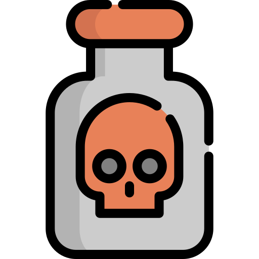

<p align="center">
  <a href="https://www.odin-matthias.de">
    
  </a>
</p>
<h1 align="center">
  ☣ Cyoanide ☣
</h1>

## Summary
Choose Your Own Adventure game "engine" built with Gatsby.


## How to run
* Install dependencies: `npm install`
* Run in dev mode: `npm run develop`
* Open http://localhost:8000


## How to use
This section details how to build your own game using Cyoanide.

### Writing your Story
Each scene/page in your story should be within a folder under `game-pages`. The folder should have a descriptive name of your scene and contain a [Markdown](https://www.markdownguide.org/cheat-sheet/) file called `index.mdx`.

Your `index.mdx` must start with frontmatter that contains configs. Some configs are necessary, some are optional.

```Markdown
---
slug: "start"                                           # mandatory slug for your page - this will be the URL used for navigating
title: "Start of the game"                              # mandatory title for your page
hero_image: "./paul-chambers-Oh0pJxCXdj8-unsplash.jpg"  # optional image for your page
music: "./chill-abstract-intention-12099.mp3"           # optional background music for your page
---

## Markdown text goes here, below the frontmatter

Lorem ipsum dolor sit amet
```

To link to another scene, simply add a Markdown link to that scene's slug.

```Markdown
---
slug: "second-scene"                                    # mandatory slug for your page - this will be the URL used for navigating
title: "Second scene"                                   # mandatory title for your page
---

You meet a spooky ghost!

[Stay here](/second-scene)
[Run back to the first scene](/start)
```


### Adding Background Music
If you put `music: "./relative-path-to-your-music.mp3"` into your scene's `index.mdx` frontmatter and put your audio file called `relative-path-to-your-music.mp3` next to `index.mdx` in the folder (or anywhere else in `game-pages` if you adjust the path), Cyoanide will loop the music in the background while the player is in your scene. 

Moving to a different scene will stop the music and start that scene's music, if any is configured. If the new scene has the same background music configured in its frontmatter, Cyoanide will simply continue playing the music.


### Advanced: Using MDX

TODO