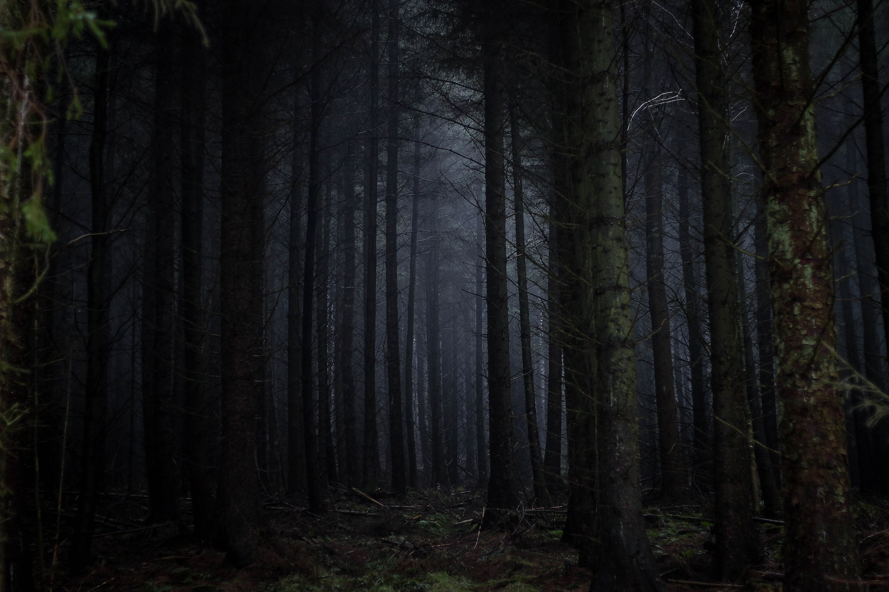
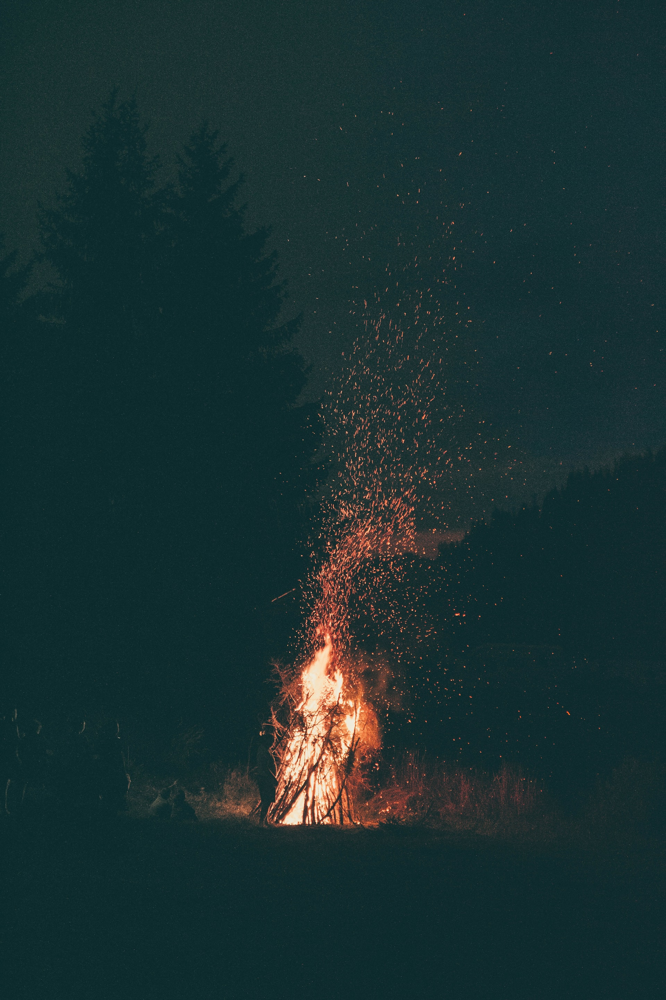

import { getLevelState } from '../../../src/SaveState'

# Return to camp

You decide to return to camp before it gets too dark and start making the arduous track back to camp. After a while the sun disappears completely and leaves you with only your flashlights illuminating the path. It is at that time that you start hearing weird noises from the surrounding bushes and trees. Maxine is scared, but Halley tells her it's just the wind rustling some leaves. You're not so sure about that, though. The wind hasn't changed, but those sounds just now started.

You quicken your step. Suddenly, Maxine let's out a cry of horror as her flashlight illuminates a transparent, humanoid figure between the trees a few meters in front of you. You see your own and three other cones of light try to trace the figure, but it vanishes as quickly as it appeared. You speed up further, almost running now. Nobody is saying a word, but you all know you have one singular goal now. Get to the camp before your flashlights die.

{
    getLevelState().includes("gathering-firewood") 
        ? 
Mere minutes away from camp exhaustion overtakes you. After you weren't able to sleep at all last night and now spent all day hiking through the woods, you just can't go on. Your legs give out, your vision fades to black. You hear a rustling noise coming towards you. You brace for the worst. Arms grip under you shoulder; it's Halley and James. They're carrying you. You can barely focus on what's happening, but they seem panicked. You can make out some of their words. They're saying that "it" is following and to hurry. You get your feet under you, try to do as much walking yourself as you can.

        : 
Mere minutes away from camp, Halley drops down, leaning against a tree. It must be because she hadn't slept last night and now spent all day hiking through the woods. You and James walk over to her to pick her up as you notice a transparent face with needle-like teeth just behind her. You quickly grab her and pull her up. She can barely stand so you start dragging her with all your remaining strength. The creautre follows you, but it doesn't catch up. It stalks you from a distance. You try to keep an eye on its location, but it vanishes and pops up again in a different spot seconds after.

}

With the last bit of your strength you make it back to the camp. You ignite the campfire with all your remaining wood, hoping that it will ward off the creature. 

{
    getLevelState().includes("gathering-firewood") 
        ? 
You grab some food and several cans of energy drinks to keep yourself going for the night, but you notice that you're barely functioning.

        : 
Halley grabs some food and several cans of energy drinks to keep herself going for the night, but you notice that she's barely functioning.

}

You plug your electronics into your powerbanks to charge. The car won't pick you up until tomorrow afternoon. You think about how you can survive the night.

<Link to="../run-away">> Escape through the forrest. It's a long way back to the road, and an even longer way back to civilization</Link>

<Link to="../try-to-sleep">> Try to sleep</Link>
